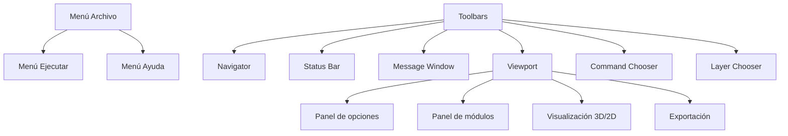

# Mockup Interfaz Gráfica ProyectoVulcano

Este diagrama muestra la estructura visual de la interfaz inicial, inspirada en Surpac.

---

---

## Descripción de áreas

- **Menú Archivo:** Abrir, guardar, salir
- **Menú Ejecutar:** Correr vista/modelo
- **Menú Ayuda:** Información y soporte
- **Toolbars:** Accesos rápidos (zoom, undo, exportar)
- **Navigator:** Explorador de archivos y carpetas
- **Status Bar:** Estado, coordenadas, conexión
- **Message Window:** Mensajes, errores, log
- **Viewport:** Visualización principal (3D/2D)
- **Command Chooser:** Ejecución de scripts/comandos
- **Layer Chooser:** Gestión de capas activas
- **Panel de opciones:** Parámetros, filtros, sliders
- **Panel de módulos:** Activación/desactivación de módulos
- **Visualización 3D/2D:** Drillholes, bloques, secciones
- **Exportación:** Botones para exportar datos

---

Este mockup sirve como referencia visual y estructural para el desarrollo de la GUI de ProyectoVulcano.